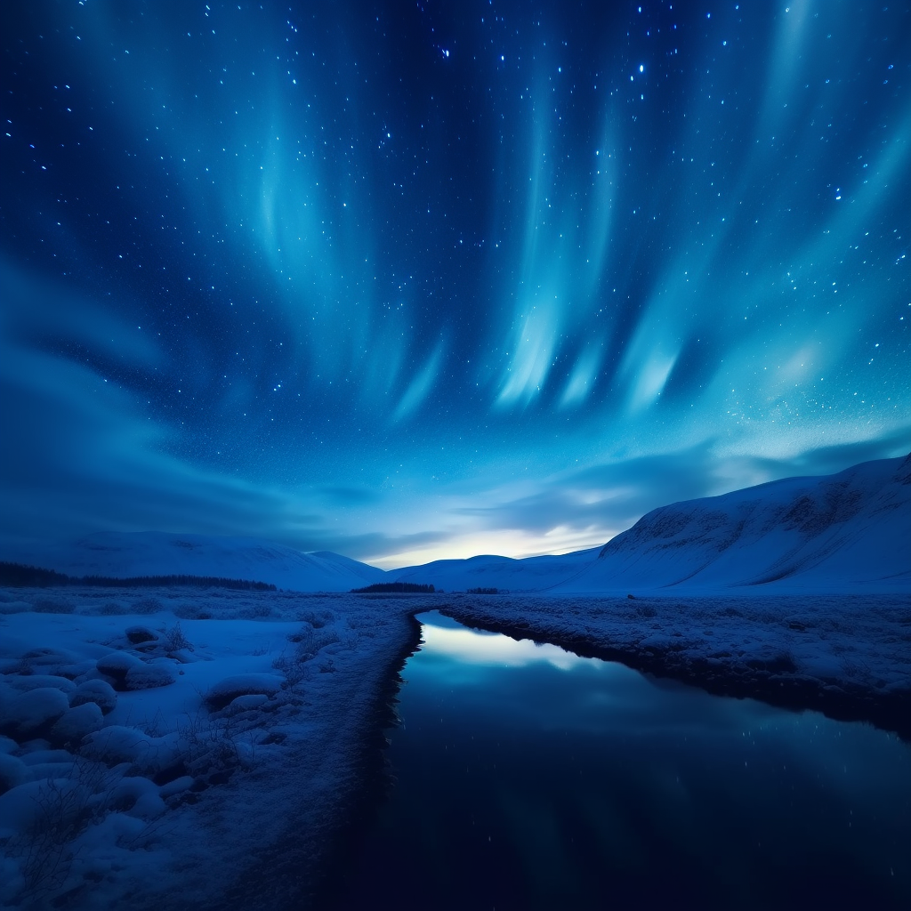
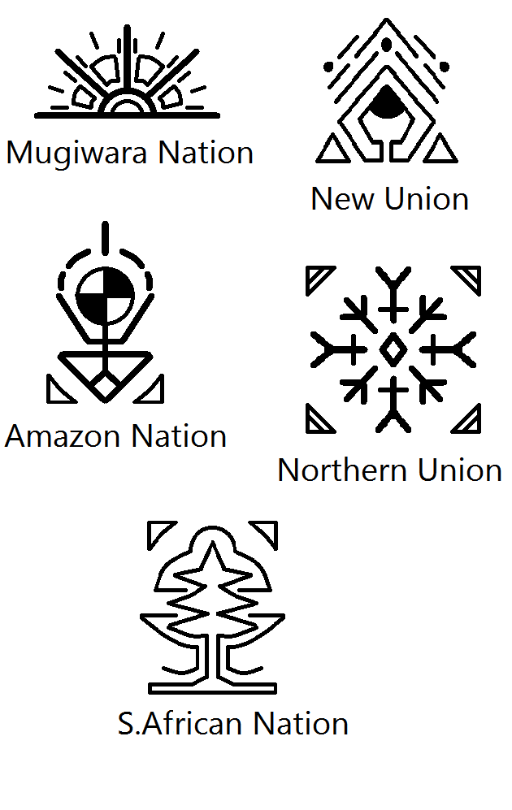

# No title yet

## Characters

### Boneless

A Zealander by birth, Boneless was a man shrouded in mystery and darkness. Abandoned by his father and orphaned at the tender age of three, he was raised in the absence of light, honing his senses in the obscurity of his surroundings. He was a phantom, a whisper in the wind, known far and wide as the stealthiest human to walk the earth. His hearing was preternatural, capable of detecting the faintest rustle miles away, and his sense of smell was sharper than any hound's. Yet, his vision was limited, unable to see beyond the tip of his nose. Despite this, or perhaps because of it, he was light on his feet, moving with a grace and silence that made him virtually undetectable. He was chosen by Kofun, the leader of the expedition, not because of familiarity, but because of the raw, untamed skill he displayed during a hunting excursion.

### Kofun

Kofun was the indomitable leader of the expedition, a beacon of intellect and strength. His mind was a labyrinth of knowledge and strategy, a testament to his exceptional intelligence. Though he was not personally acquainted with Boneless, he was captivated by the Zealander's stealth and cunning, recognizing the potential in his unconventional skills. Kofun was a force to be reckoned with, his strength and speed unparalleled. Yet, he was aware of his vulnerability, knowing that Boneless could easily slip behind him, unseen and unheard, and strike a fatal blow before he could even blink.

### Jonna (pronounced Yonna)

Jonna, pronounced 'Yonna', was a young woman hailing from the lush, tropical forests of Australia. An orphan with no parents or cousins, she found solace and companionship in her two brothers, Koyang and Horang. Her appearance was as mercurial as her moods, subtly shifting and changing in a way that was both enchanting and disconcerting. Yet, despite these peculiarities, she possessed no superhuman abilities or powers, or so she believed.

### Koyang

Koyang, Jonna's younger brother, was a silent guardian, his world devoid of sound due to his deafness. Unable to speak, he communicated through his expressive eyes, which were as flexible and agile as a cat's. His vision was remarkable, capable of discerning the smallest details from a distance, and his body was lithe and nimble, allowing him to navigate any terrain with ease.

### Horang

Horang, Jonna's older brother, was a paradox. On the surface, he appeared to be an ordinary man, devoid of any extraordinary abilities. Yet, beneath this facade of normalcy, he was fearless, his courage unwavering in the face of danger. He could fight any creature, no matter how formidable, and emerge victorious, a testament to his strength and determination.

## Chapter 0: The Beginnning

The year is 3010, nine decades after the 10th World War, a cataclysmic conflict that eradicated nearly all life, leaving behind a scattered few humans, bitter and divided. The world is now a post-apocalyptic wasteland, with only five major forces, five formidable cities, ruling over the remnants of civilization.

The most dominant force, the New Union, stands tall in the heart of Africa. The second largest, the Northern Union, is nestled deep within the Siberian Forest, now a wild and untamed tropical wilderness. The third nation, the Amazon Nation, lies in what was once a lush rainforest, now a vast desert of endless sand, governed solely by women. The fourth nation, the Mugiwara Nation, is based in Japan, while the smallest of the five is situated in South Africa.

The world's population has plummeted from a staggering 15 billion to a mere 3 billion. Or so the nations believe. Unrest, as inevitable as the rising sun, has begun to stir. The world's landscape has been drastically reshaped. North America lies in ruins, a charred wasteland incapable of sustaining life. The once verdant Amazon rainforest has been reduced to a barren desert. The African Sahara, once a sea of sand, is now a vast ocean, while its former jungles have given way to sprawling savannas. Siberia, once a frozen tundra, is now a wild and dense tropical forest, as is Australia, where unexpected transformations have occurred due to the drastic climate shifts following the war.

The New Union has a unique form of punishment: exile to New Zealand, a land riddled with deadly radiation. It is a sentence akin to death. Most of those banished perish, but a few survive, albeit not unscathed. Generation after generation, they mutate, evolving into something other than human. The five nations remain oblivious to these changes, too fearful of the radiation to venture into the forsaken land.

In New Zealand, the third generation of survivors has come of age. The mutation process has stabilized, and they are no longer dying. Instead, they have developed new abilities. They are organizing themselves as a new nation, but their land can no longer accommodate their growing numbers. The council of Zealand elders has decided to send an expedition to Australia, a group of 250 younglings from the new generation, tasked with exploring the depths of the tropical forest and uncovering its secrets.

Meanwhile, in the heart of Australia, a small community of humans has managed to survive, hidden from the world. Numbering only a few hundred, they live high in the trees, each family existing in isolation, with no interaction with strangers. Their existence remains a secret, even from the five major nations.

## Chapter 1: Breaking Routine - Into The Unknown

With only two weeks left before the expedition, Boneless made his way up the hill where his parents were laid to rest. After a heartfelt farewell, he descended and meandered through the city. The New Nation was preparing to send another boatload of exiles in a week's time. The expedition team needed that boat to travel faster and was willing to risk everything to take it over. A group of aqua-mutants was chosen to hijack the vessel.

As the boat landed and prisoners disembarked, Boneless perched on a cliff, listening to the aqua-mutants attempting to infiltrate the ship. Kofun's voice echoed in his mind, calling him from miles away. The mission was a success; they had secured the boat, and the expedition could finally commence.

Kofun assembled the entire team of 250 people to discuss the final details. They were divided into five groups based on their strengths and weaknesses: a group of tanks, the strongest; a group of aqua-mutants; a group of assassins; a group of hunters; and a group of fighters. Boneless was appointed as the leader of the assassins.

The day of departure had arrived. Boneless, armed with his two daggers, brought along his little mutated dog, Rack. Everyone gathered near the harbor, eager to board the boat.

One day, Jonna and Koyang ventured out in search of fruits and vegetables. They had a waterfall next to their tree, inside which was their secret cave where they stored all their belongings: food, animal skins and fur, weapons, and traps. They grabbed their leather bags, and Jonna took her bow and arrows. Koyang didn't need any of that; he just took his ball made of some animal's head.

As they walked, they encountered the Others, but there were no words or even eye contact exchanged. The Others were carrying something strange and covered, but Jonna and Koyang's curiosity wasn't piqued enough to investigate. They continued on their way and arrived at the beach after about four hours. Jonna wanted to catch some fish for Horang, who loved it.

The journey from New Zealand to Australia took about 8 to 9 hours, with at least 3 hours spent figuring out how to sail and steer the boat. The rules of the expedition were clear: do not kill anything (or anyone) until ordered.

Upon their arrival at the beach, they were unsure of what to expect. Enormous trees covered the entire coastline. Boneless stood there, emotionless, listening intently to the forest sounds, trying to determine if there were any monsters or dangers ahead. Among the cacophony of sounds, he could hear the breathing of two creatures on the other side of the beach. But they were of no concern to him; they were just potential prey.

## Chapter 2: Dangerous Encounter - Starting Discovery

As the expedition progressed, the tanks were ordered to lead the way through the jungle, with assassins sent ahead to scout for creatures and traps. Boneless, with his exceptional hearing, could distinguish the breathings of various creatures, but he held his ground and followed his orders.

As the expedition delved deeper into the heart of the unknown, the tanks were commanded to take the lead, their imposing forms plowing through the dense undergrowth. A vanguard of assassins was dispatched ahead, their keen senses and deadly skills put to use in scouting for any lurking dangers, be it beast or trap. Among these lethal scouts was Boneless, his extraordinary auditory abilities allowing him to discern the unique breathing patterns of a multitude of creatures. The cacophony of sounds that would have overwhelmed a lesser being was, to him, a symphony of information. Yet, despite the tantalizing allure of the unknown that beckoned him, he remained steadfast in his duty. With unwavering discipline, he held his ground, following his orders to the letter, his every movement a silent testament to his training and focus.

Meanwhile, Jonna and Koyang were at the beach, with Jonna fishing and Koyang playing with his ball. When Koyang saw a boat full of strange beings in the distance, he was terrified and rushed back to his sister, trembling. Jonna assumed he had seen a large animal and reassured him, but as they headed back to their tree, they heard strange voices getting louder and louder.

Back at the camp, Kofun gathered the five leaders to discuss their plan to proceed with the discovery of the land. He gave instructions to each team, and to Boneless, he gave a special order: to capture one of the humans that they believed were living in the area. Boneless nodded and set out on his mission.

As night fell, Jonna and Koyang heard the strange voices getting closer and closer to their tree. They were shocked to discover a group of strangers camping next to their waterfall. Boneless, using his sonar-like ability, spotted Jonna and Koyang and knocked them out, taking them back to the camp.

When Jonna regained consciousness, she found herself and her brother tied up and guarded by two massive beings. She quickly freed herself and her brother, and they attempted to escape, but were surrounded by a group of assassins, hunters, and fighters.

Just as things were looking dire, Kofun stepped in and signaled for his team to stand down. He approached the three humans, raising his hands in a peaceful gesture, and attempted to communicate with them. Jonna, feeling threatened, had transformed into a hardened, flaming-skinned form, but she calmed down and returned to her normal state. Using signs, she attempted to communicate with Kofun, asking him what they were doing there and where they had come from. The confusion was clear on both sides, but a tentative truce was established, and the two groups began to learn more about each other.

## Chapter 3: Unwelcomed Strangers - A feast for peace

Kofun quickly realized that Jonna was using a form of sign language to communicate with her brothers. As a highly intelligent individual, he began to decipher the signs, gradually understanding their meaning. He listened closely to their conversation, picking up words and building a vocabulary of their language. Within a short amount of time, he had learned around 80 words.

Jonna, still wary of the strangers, instructed her brothers to stay alert. Horang suggested that he would try to gather the Others when the opportunity presented itself, and that Jonna should take Koyang back home. Suddenly, Kofun began speaking to them in their own language, leaving the siblings shocked and impressed. How had he managed to learn their language so quickly?

Kofun offered the siblings protection, food, and other goods in exchange for information about the land. He assured them that his people had come only to explore and that they meant no harm. The siblings exchanged glances, unsure of whether to trust him or not. After a moment of hesitation, Horang accepted Kofun's offer and welcomed them.

Despite Horang's decision, the siblings remained skeptical. How could they fully trust an army of warriors and assassins armed with weapons? Koyang, determined to protect his family and the Others, quietly slipped away to warn them about the newcomers. He moved stealthily, careful not to make any noise that would alert the strangers.

Kofun's intentions were genuine; he truly came in peace. He was eager to learn the siblings' language and communicate with them effectively. When he noticed that Koyang was missing, he asked Jonna about his whereabouts, but she refused to disclose any information. Despite this, Kofun invited the siblings to join his people for a feast.

Meanwhile, some of the Others were gathered in the sanctuary, worshiping their deities. Koyang arrived and tried to mimic a warning to them, but they didn't believe him. Instead, they sent two of their members back with Koyang to investigate the situation.

The assassins spotted Koyang and the two Others and reported it to Boneless. However, Boneless decided not to inform Kofun immediately. Instead, he took an assassin with him to investigate the situation further. When they arrived at the sanctuary, Boneless sent the assassin back to inform Kofun, while he stayed behind to watch over the Others.

Kofun knew that the Others wouldn't trust him easily, so he decided to do something drastic. He took three-quarters of his army with him and surrounded the sanctuary. In a hurry, he organized a feast and invited the Others to join him. Using his limited knowledge of their language, he tried to explain their intentions and propose a peaceful alliance.

The Australians were divided into two groups, the Primales and the Enlightened. The Primales, like Jonna and her brothers, were primitive and lived in the wild. They referred to the second group as the Others, but in reality, they were known as the Enlightened. The Enlightened saw an opportunity to use the expedition for their own benefit. They had a hidden place deep in the woods, with sophisticated buildings and high technology, but they kept it hidden from the Primales. They wanted to keep the Primales as primitives, so they pretended to appreciate Kofun's gesture and proposed to lead the expedition to their hidden place.

Three days later, the expedition started.

